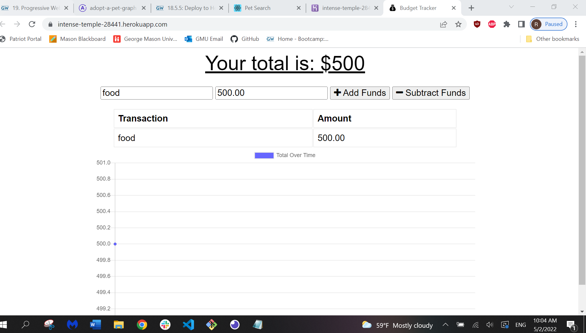

# pwa-budget-tracker
# Description
This app allows companies to track their budget without an internt connection .

AS AN avid traveler
I WANT to be able to track my withdrawals and deposits with or without a data/internet connection
SO THAT my account balance is accurate when I am traveling 
# Installation
First you will need VS Code, run npm install in your terminal, then install packages such as express.js, sequelize and dotenv package 
# Usage
This project highlights my ability to create the back end of an e-commerce website. It uses express.js APIand Sequelize to interact with a MYSQL database
# Contributors 
Rebekah818
# links

https://github.com/Rebekah818/pwa-budget-tracker

# ScreenShot

# Table of Contents
Project Name
 
Description
 
Installation
 
Usage
 
Contributors
 
Links
 
screenshots